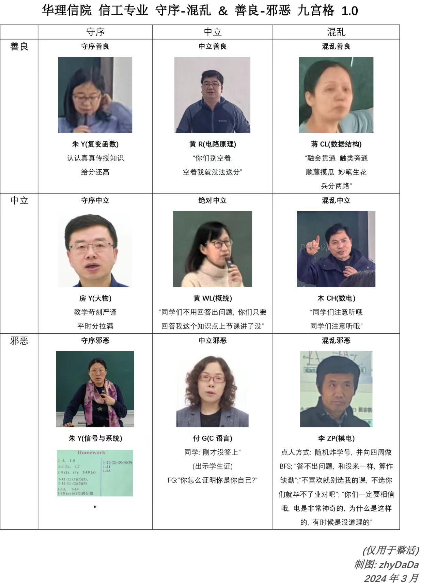

# 模拟电子技术及实验（3学分）
>
> 免责声明：不保证实验报告的正确性。

信工专业，3学分。唯一指定教师李振坡，平时成绩一般。作业布置很少，可能对考试题型没啥概念。

所以做了回忆版考题，欢迎补充/替换。

课件不在超星学习通上，因此以文件形式上传。

## 2024学年补充

坡坡~

这个老师给我第一印象是神金, 因为他我那个时候实在受不了做了九宫格(乐)。
  
但说实话课上到后面, 慢慢觉得他实操方面还是比较硬的, 当做神人老师看慢慢也觉得他有点好玩了  
回到学科上, 这门课比较硬, 推荐b站 [郑益慧老师](https://www.bilibili.com/video/BV1Gt411b7Zq/?share_source=copy_web&vd_source=146c73d267112934fbc38c065c808868), 提前学好了才能回答的上坡坡的刁钻问题  
临考复习的时候可以看看这个: [【【模拟电子技术】清华阳哥10h期末速成课】] (<https://www.bilibili.com/video/BV1V841157vH/?share_source=copy_web&vd_source=146c73d267112934fbc38c065c808868>)

from [zhyDaDa](https://origin.zhydada.com/)
